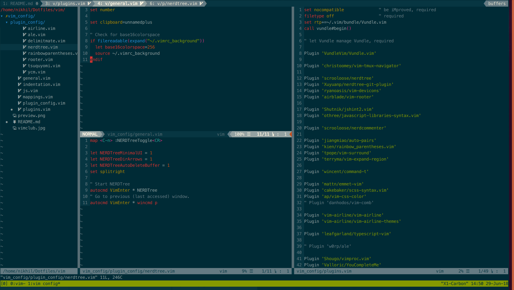

# VIM

## Notes:

* Colorscheme requires [base16-shell](https://github.com/chriskempson/base16-shell)
* [Required Font](https://github.com/ryanoasis/nerd-fonts/tree/master/patched-fonts/Meslo/M)
* Install [the silver searcher](https://github.com/ggreer/the_silver_searcher)
* Install [ctags](http://ctags.sourceforge.net/)
* Sass linting needs global install of sass-lint (`npm i -g sass-lint`)
* Coc needs a setting file to be placed or symlinked in ~/.vim
* Coc post-installation: `:call coc#util#install()`
* Coc post-installation: `:CocInstall coc-tsserver coc-eslint coc-json coc-css`

## Preview:

