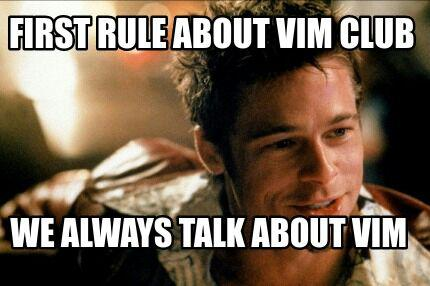

# VIM

## Notes:

* Command-T needs to be compiled after downloading.
* [Required Font](https://github.com/ryanoasis/nerd-fonts/tree/master/patched-fonts/Meslo/M)
* Colorscheme requires [base16-shell](https://github.com/chriskempson/base16-shell)

## Preview:

